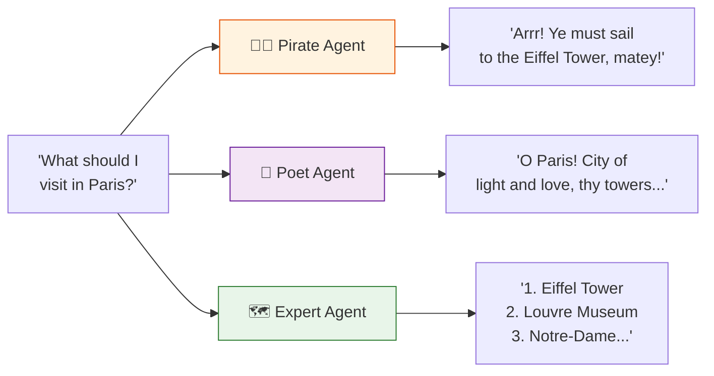

# Lab 2: Agent Personas & Prompt Engineering

[📋 Back to Lab Guide](../../lab-guide.md)

**Duration:** 15 minutes  
**Objective:** Understand how system instructions dramatically shape agent behavior and learn prompt engineering basics.

---

## What You'll Learn

- How system instructions (the "system prompt") define an agent's personality, style, and constraints
- Prompt engineering techniques: role definition, output format, guardrails
- How the same model produces wildly different responses based on instructions alone

---

## Conceptual Overview

---

## Implementation

Choose your language:

- **[C# (.NET)](./csharp.md)**
- **[Python](./python.md)**

---

## 🏋️ Exercises

### Exercise B: The Constraint Challenge

Create agents with increasingly strict constraints and see how they behave:

| Agent | Constraint |
|-------|-----------|
| `WordCounter` | "Always state the exact word count of your response at the end." |
| `Questioner` | "Never give direct answers. Always respond with a clarifying question." |
| `Contrarian` | "Always present the opposing viewpoint, then acknowledge the original view." |
| `ELI5` | "Explain everything as if talking to a 5-year-old. Use only simple words." |

---

## ✅ Success Criteria

- [ ] Same question produces different responses across 5+ personas
- [ ] You've built a domain expert with role, format, and guardrail instructions
- [ ] You understand how instructions = the primary control lever for agent behavior

---

## 📚 Key Takeaway

> System instructions are the **single most important design decision** when building an agent. Before writing any code, write your prompt.
