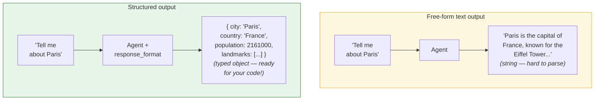

# Lab 5: Structured Output

[📋 Back to Lab Guide](../../lab-guide.md)

**Duration:** 15 minutes  
**Objective:** Get typed, structured responses from an agent instead of free-form text.

---

## What You'll Learn

- How to get structured, typed results from an agent
- How to use schema-based structured output
- When structured output is useful (data extraction, API responses, form filling)

## When to Use This Pattern

Use **structured output** when downstream code needs to parse the agent's response:

- **API responses** — returning JSON to a frontend or another service
- **Data extraction** — pulling entities, facts, or fields from unstructured text
- **Pipeline steps** — feeding agent output into another function or workflow
- **Form filling** — mapping natural language input to typed fields

**When free-form text is fine:**

| Scenario | Use |
|----------|-----|
| Conversational chat | Free-form text — structured output adds unnecessary rigidity |
| Creative writing / summaries | Free-form text — let the LLM be expressive |
| Fixed format needed for code | **Structured output** — guarantees valid JSON matching your schema |

---

## Conceptual Overview

---

## Implementation

Choose your language:

- **[C# (.NET)](./csharp.md)**
- **[Python](./python.md)**

---

## ✅ Success Criteria

- [ ] Extracted a `PersonInfo` object from unstructured text
- [ ] Extracted a list of meeting items from notes
- [ ] Can envision how structured output fits into real applications (APIs, databases, forms)

---

## 📚 Reference

- [Structured Output docs](https://learn.microsoft.com/en-us/agent-framework/agents/structured-output)
