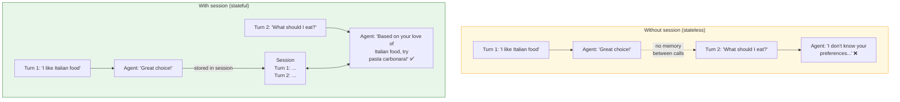

# Lab 6: Multi-Turn Conversations & Sessions

[📋 Back to Lab Guide](../../lab-guide.md)

**Duration:** 20 minutes  
**Objective:** Build a stateful agent that maintains conversation context across multiple turns using sessions.

---

## What You'll Learn

- How sessions maintain conversation context across turns
- How the agent "remembers" what was said earlier in the conversation
- The difference between stateful (with session) and stateless (without session) calls
- How to serialize and restore sessions for persistence

## When to Use This Pattern

Use **sessions** when your agent needs to remember previous turns in a conversation:

- **Conversational apps** — chatbots, assistants, support agents where users follow up
- **Multi-step tasks** — gathering information across turns ("What's your name?" → "And your email?")
- **Personalization** — the agent adapts based on what the user already said

**When stateless is better:**

| Scenario | Use |
|----------|-----|
| Single-shot Q&A, one-off tasks | **Stateless** — no session overhead |
| Batch processing / pipelines | **Stateless** — each input is independent |
| User follows up or refines requests | **Sessions** — context carries across turns |

---

## Conceptual Overview

---

## Implementation

Choose your language:

- **[C# (.NET)](./csharp.md)**
- **[Python](./python.md)**

---

## ✅ Success Criteria

- [ ] Agent maintains conversation context across multiple turns using a session
- [ ] Agent loses context when no session is provided
- [ ] You've had a multi-turn conversation where the agent references earlier context
- [ ] You understand that sessions are isolated — different sessions = different conversations

---

## 📚 Reference

- [Official Step 3: Multi-Turn](https://learn.microsoft.com/en-us/agent-framework/get-started/multi-turn)
- [Official Step 4: Memory](https://learn.microsoft.com/en-us/agent-framework/get-started/memory)
- [Session docs](https://learn.microsoft.com/en-us/agent-framework/agents/conversations/session)
