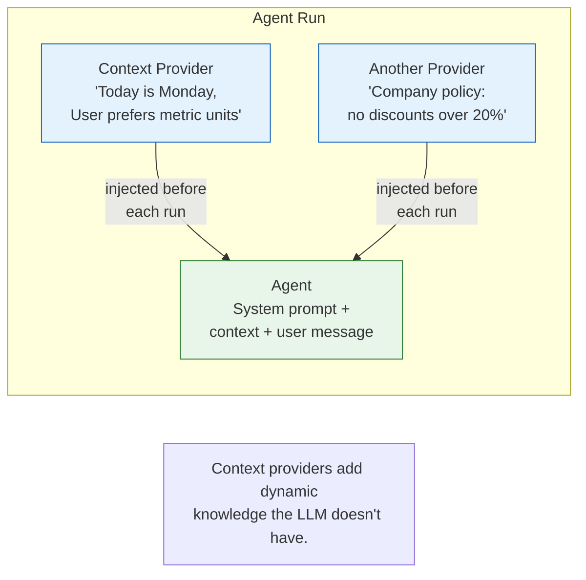

# Lab 7: Context Providers & Memory

[📋 Back to Lab Guide](../../lab-guide.md)

**Duration:** 20 minutes  
**Objective:** Build a custom context provider that injects persistent knowledge into every agent run.

---

## What You'll Learn

- The difference between session history (conversation turns) and context providers (injected knowledge)
- How to create a custom context provider that remembers user preferences
- How context providers modify the agent's behavior across sessions

## When to Use This Pattern

Use **context providers** when the agent needs dynamic information injected at runtime:

- **User-specific data** — preferences, roles, permissions, locale
- **Real-time info** — current date/time, business hours, system status
- **Business rules** — policies, pricing tiers, feature flags that change independently of the agent's instructions

**When alternatives are better:**

| Instead of a context provider… | Use… | Why |
|--------------------------------|------|-----|
| Context never changes | **System prompt** (Lab 2) | Simpler — just hardcode in instructions |
| Context comes from the conversation | **Sessions** (Lab 6) | Already captured in conversation history |
| Context requires an external call | **Function tool** (Lab 3) | Let the LLM decide when to fetch it |

---

## Conceptual Overview

---

## Implementation

Choose your language:

- **[C# (.NET)](./csharp.md)**
- **[Python](./python.md)**

---

## ✅ Success Criteria

- [ ] Agent personalizes responses based on injected user context
- [ ] Different users get different code examples (C# vs Python)
- [ ] You understand how context injection differs from conversation history

---

## 📚 Reference

- [Official Step 4: Memory](https://learn.microsoft.com/en-us/agent-framework/get-started/memory)
- [Session docs](https://learn.microsoft.com/en-us/agent-framework/agents/conversations/session)
