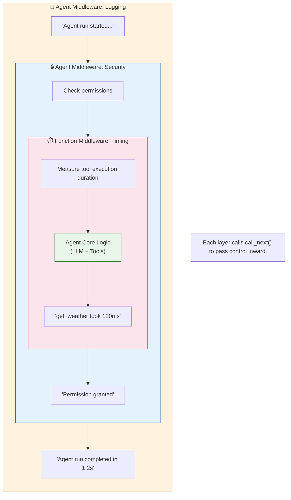

# Lab 8: Middleware Pipeline

[📋 Back to Lab Guide](../../lab-guide.md)

**Duration:** 20 minutes
**Objective:** Build a middleware pipeline that adds logging, security, and telemetry to an agent without modifying core logic.

---

## What You'll Learn

- Three types of middleware: Agent Run, Function Calling, IChatClient
- How middleware chains form a pipeline (order matters!)
- Practical patterns: logging, security, result modification
- How to keep agent code clean while adding enterprise concerns

## When to Use This Pattern

Use **middleware** for cross-cutting concerns that apply to multiple agents without modifying their logic:

- **Logging & telemetry** — trace every agent run and tool call
- **Security** — validate inputs, check permissions, filter outputs
- **Content filtering** — block harmful content before/after the LLM
- **Rate limiting** — throttle calls per user or per agent

**When middleware is overkill:**

| Scenario | Use instead |
|----------|-------------|
| Logic specific to one agent | **Put it in the agent's instructions or tools** |
| One-off debugging | **Temporary console.log / print statements** |
| Full distributed tracing | **Observability** (Lab 13) — purpose-built for this |

---

## Conceptual Overview

---

## Implementation

Choose your language:

- **[C# (.NET)](./csharp.md)**
- **[Python](./python.md)**

---

## 🏋️ Exercises

### Exercise A: Add Rate Limiting Middleware

Create middleware that limits the number of calls per session. If the count exceeds a threshold (e.g., 5), return a rate-limit message instead of calling the agent.

### Exercise B: Result Modifier Middleware

Create function middleware that appends a disclaimer to every tool result (e.g., "Data is simulated for demonstration.").

### Exercise C (Stretch): Middleware Ordering Experiment

1. Move the security check logic AFTER the logging logic inside the `.Use()` call — what changes?
2. Remove the security check entirely — does the blocked query now succeed?
3. **Key insight:** In the combined `.Use()` call, the order of logic within the lambda determines execution order. Security checks should always run first.

---

## ✅ Success Criteria

- [ ] Security middleware blocks sensitive queries before they reach the agent
- [ ] Logging middleware shows turn counts and timing
- [ ] Function logging middleware shows which tools are called with what arguments
- [ ] You understand that middleware order determines execution order

---

## 📚 Reference

- [Middleware docs](https://learn.microsoft.com/en-us/agent-framework/agents/middleware/)
