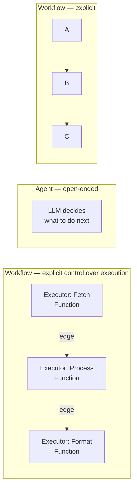

# Lab 11: Simple Workflows — Function Pipelines

[📋 Back to Lab Guide](../../lab-guide.md)


**Duration:** 15 minutes
**Objective:** Understand workflow basics by building function-based pipelines with executors and edges.

---

## What You'll Learn

- The difference between agents (open-ended) and workflows (explicit control)
- Workflow building blocks: Executors, Edges, WorkflowContext
- How to chain function executors and agent executors
- How data flows through a workflow graph

## When to Use This Pattern

Use **simple (function) workflows** when you need deterministic multi-step processing where each step is predictable code:

- **Data pipelines** — validate → transform → enrich → store
- **Business processes** — each step has clear inputs/outputs
- **Mix of code and AI** — some steps are pure functions, others use agents

**When to choose a different pattern:**

| Scenario | Use |
|----------|-----|
| Every step needs LLM reasoning | **Agent Workflows** (Lab 12) |
| The LLM should decide which steps to run | **Agent-as-Tool** (Lab 10) |
| Steps can run in parallel | **Concurrent Workflows** (Lab 20) |
| Routing depends on input content | **Handoff Workflows** (Lab 18) |

---

## Conceptual Overview



---

## Implementation

Choose your language:

- **[C# (.NET)](./csharp.md)**
- **[Python](./python.md)**

---

## 🏋️ Exercises

### Exercise A: Add a Third Step — Translator

Add a `TranslatorExecutor` that takes the English summary and translates it:

```
Topic → Research → Writer → Translator → Output
```

- Create a `TranslatorAgent` with instructions: `"Translate the following text to French."`
- Add a `TranslatorExecutor` that wraps this agent
- Add an edge from `writer` to `translator`
- Make the translator yield the final output

### Exercise B: Three-Step Pipeline with Validation

Add a validation step between Research and Writer:

```
Topic → Research → Validator → Writer → Output
```

The Validator checks if the research has at least 3 bullet points. If not, the workflow should request more research (you can simulate this with a conditional edge or by having the validator simply append "Please provide more detail" and loop back).

### Exercise C (Stretch): Parallel Fan-Out

Create a workflow where **two research agents** work in parallel on different aspects of a topic, then a writer combines both:

```
             ┌→ TechResearch ──┐
Topic ──────→│                  │→ Writer → Output
             └→ BusinessResearch┘
```

Hint: Look into `AddEdge` with multiple sources or `BuildConcurrent` patterns.

---

## ✅ Success Criteria

- [ ] Simple function workflow runs: UpperCase → Reverse
- [ ] Agent workflow runs: Research → Writer
- [ ] You can see data flowing between steps via the console logs
- [ ] You understand how `AgentWorkflowBuilder.BuildSequential` chains agents together

---

## 📚 Reference

- [Official Step 5: Workflows](https://learn.microsoft.com/en-us/agent-framework/get-started/workflows)
- [Workflows overview](https://learn.microsoft.com/en-us/agent-framework/workflows/)
- [Workflow samples on GitHub](https://github.com/microsoft/agent-framework/tree/main/dotnet/samples/03-workflows)
