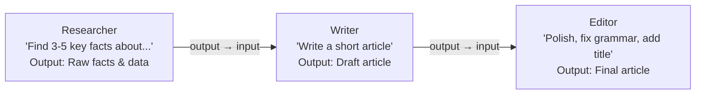

# Lab 12: Agent Workflows — LLM-Powered Pipelines

[📋 Back to Lab Guide](../../lab-guide.md)


**Duration:** 20 minutes
**Objective:** Build a workflow where real LLM agents collaborate as pipeline steps — Research → Write → Translate.

---

## What You'll Learn

- How to wrap `AIAgent` instances as workflow executors
- How agent output flows as typed messages between workflow steps
- How to build a practical content generation pipeline

## When to Use This Pattern

Use **agent workflows** when each step in your pipeline benefits from LLM reasoning:

- **Content pipelines** — draft → review → edit → finalize (each step needs creative judgment)
- **Analysis chains** — summarize → critique → synthesize (iterative refinement)
- **Multi-perspective processing** — different agent personas analyze the same input sequentially

**When to choose a different pattern:**

| Scenario | Use |
|----------|-----|
| Steps are pure code (no LLM needed) | **Simple Workflows** (Lab 11) — faster, cheaper |
| LLM should decide which agents to call | **Agent-as-Tool** (Lab 10) — dynamic routing |
| Agents should discuss together | **Group Chat** (Lab 19) — shared conversation |

---

## Conceptual Overview



---

## Implementation

Choose your language:

- **[C# (.NET)](./csharp.md)**
- **[Python](./python.md)**

---

## 🏋️ Exercises

### Exercise A: Change the Target Language

Modify the `TranslatorExecutor` to accept a different target language. Try Spanish, Japanese, or Dutch.

### Exercise B: Add a Quality Check Step

Insert a `ReviewerExecutor` between Writer and Translator that evaluates quality and either passes through or requests a rewrite:

```
Research → Writer → Reviewer → Translator → Output
```

### Exercise C (Stretch): Parallel Research

Create two research agents that investigate different aspects of the topic in parallel, then have the writer synthesize both:

```
              ┌→ TechResearch ──────┐
Topic ───────→│                      │→ Writer → Translator → Output
              └→ EthicsResearch ─────┘
```

---

## ✅ Success Criteria

- [ ] Three-step pipeline runs successfully: Research → Write → Translate
- [ ] Each agent transforms the output and passes it to the next step
- [ ] Console logs clearly show data flowing through each executor
- [ ] You understand how `AgentWorkflowBuilder.BuildSequential` and `InProcessExecution.Default.RunAsync` work together

---

## 📚 Reference

- [Workflows overview](https://learn.microsoft.com/en-us/agent-framework/workflows/)
- [Official Step 5: Workflows](https://learn.microsoft.com/en-us/agent-framework/get-started/workflows)
