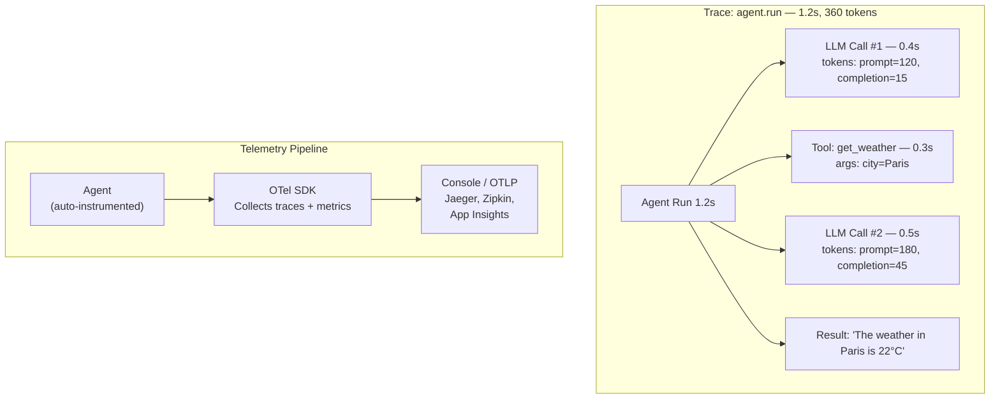

# Lab 13: Observability & Telemetry

[📋 Back to Lab Guide](../../lab-guide.md)

**Duration:** 20 minutes
**Objective:** Add OpenTelemetry tracing and metrics to an agent for production monitoring.

---

## What You'll Learn

- How to instrument an agent with OpenTelemetry
- How to view traces, logs, and metrics for agent runs
- How to track token usage, latency, and tool calls
- Why observability is critical for production agents

## When to Use This Pattern

Use **observability** whenever agents move beyond prototyping:

- **Production deployments** — monitor latency, errors, and token costs
- **Debugging** — trace exactly which tools were called, in what order, with what inputs
- **Cost management** — track token usage per agent, per user, per workflow
- **Compliance/audit** — log all agent decisions and tool invocations

> **Rule of thumb:** If you're deploying agents to users, you need observability. It's not optional — it's how you understand what your agents are actually doing.

---

## Conceptual Overview

---

## Implementation

Choose your language:

- **[C# (.NET)](./csharp.md)**
- **[Python](./python.md)**

---

## 🏋️ Exercises

### Exercise A: Track Token Usage Across Turns

Parse the trace output and calculate:
- Total input tokens across all turns
- Total output tokens across all turns
- Average tokens per turn
- Cost estimate (e.g., $0.15 per 1M input tokens for gpt-4o-mini)

### Exercise B: Add Metrics Export

Add a meter provider to also export metrics to the console alongside traces.

### Exercise C (Stretch): Export to Aspire Dashboard

If you have the Aspire Dashboard running locally, configure OTLP export to send traces to `http://localhost:4317`.

---

## ✅ Success Criteria

- [ ] OpenTelemetry traces appear in console output
- [ ] You can see agent name, instructions (sensitive data), and token counts in traces
- [ ] Tool calls appear as separate spans with timing
- [ ] You understand why observability matters for cost tracking, debugging, and compliance

---

## 📚 Reference

- [Observability docs](https://learn.microsoft.com/en-us/agent-framework/agents/observability)
- [OpenTelemetry GenAI conventions](https://opentelemetry.io/docs/specs/semconv/gen-ai/)
