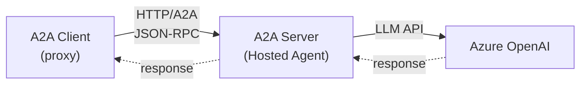

# Lab 17: A2A Client — Calling Remote Agents

[📋 Back to Lab Guide](../../lab-guide.md)


**Duration:** 20 minutes
**Objective:** Use the **A2A (Agent-to-Agent) protocol** to call a remote agent hosted over HTTP. You'll first start an A2A server and then build a client that discovers and communicates with it.

---

## What You'll Learn

- How to host an agent as an A2A server
- How to use an A2A client proxy to call remote agents
- Agent discovery via A2A agent cards
- How A2A enables cross-framework agent interoperability

## When to Use This Pattern

Use an **A2A client** when your agent needs to call a remote agent over the network:

- **Consuming external agents** — calling agents built by other teams or vendors
- **Cross-language calls** — your Python agent calling a C# agent (or vice versa)
- **Agent marketplace** — discovering and calling agents by their A2A agent card
- **Distributed systems** — agents running in separate processes, containers, or clouds

**When alternatives are better:**

| Scenario | Use |
|----------|-----|
| The agent is in the same codebase | **Agent-as-Tool** (Lab 10) — no network overhead |
| You want tool-level interop (not agent-level) | **MCP** (Lab 15) — standard tool protocol |
| You need a full orchestrated workflow | **Workflows** (Lab 11/12) — explicit control |

## Prerequisites

- Completed Lab 14 (Hosting & A2A Protocol)
- Azure OpenAI endpoint configured

---

## Architecture



---

## Implementation

Choose your language:

- **[C# (.NET)](./csharp.md)**
- **[Python](./python.md)**

---

## Key Concepts

| Concept | Description |
|---------|-------------|
| **A2A Protocol** | Standardized agent-to-agent communication over HTTP using JSON-RPC |
| **A2A Server** | Hosts an agent and exposes it via the A2A protocol |
| **A2A Client** | A proxy that wraps a remote A2A endpoint as a local agent |
| **Agent Card** | Metadata document describing the agent's capabilities (GET `/v1/card`) |
| **Cross-Framework** | A2A enables agents built with different frameworks to communicate |

## Agent Discovery

The A2A protocol supports agent discovery via agent cards. You can fetch the card:

```bash
curl http://localhost:5100/a2a/travel-assistant/v1/card
```

This returns JSON metadata about the agent (name, description, version, capabilities).

---

## 🏋️ Exercises

### Exercise A: Explore Agent Cards

Start the A2A server and use `curl` to fetch the agent card. Examine the metadata returned.

### Exercise B: Multiple Questions

Send several different travel-related questions to the remote agent and observe how it handles each one.

---

## 🎯 Challenge

Extend the client to also act as an agent itself — create a "Trip Planner" agent that uses the remote Travel Assistant as a tool!

---

## ✅ Success Criteria

- [ ] A2A server is running and accessible
- [ ] A2A client successfully communicates with the remote agent
- [ ] You can fetch the agent card via HTTP
- [ ] You understand the A2A client-server communication pattern

---

## What's Next?

In **Lab 18**, you'll build **handoff workflows** — where a triage agent intelligently routes customer queries to the right specialist agent.
