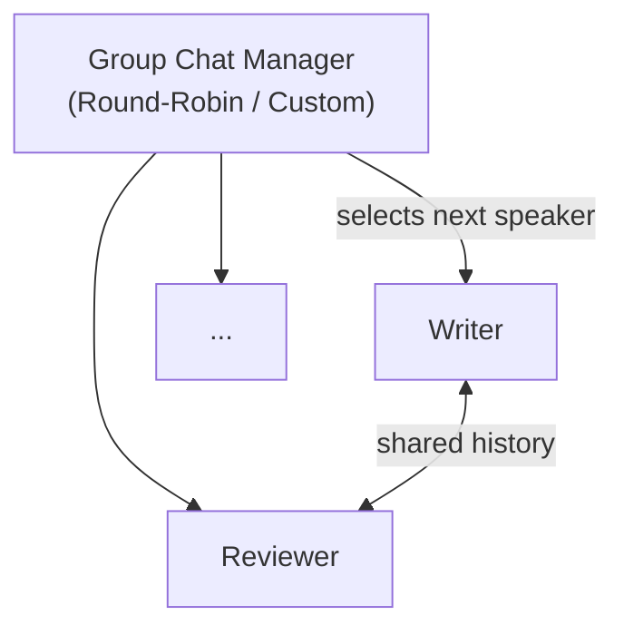

# Lab 19: Group Chat — Collaborative Agent Conversations

[📋 Back to Lab Guide](../../lab-guide.md)

**Duration:** 25 minutes
**Objective:** Build a **group chat workflow** where multiple agents collaborate in a shared conversation. A manager orchestrates who speaks next, and agents iteratively refine each other's work. You'll also explore custom termination logic that stops the conversation based on content.

---

## What You'll Learn

- How to build group chat workflows for multi-agent collaboration
- Using round-robin speaker selection for turn management
- Building custom termination logic (e.g., approval-based)
- Processing the full conversation history from workflow output

## When to Use This Pattern

Use **group chat** when agents should collaborate through shared conversation:

- **Review & critique** — multiple perspectives on the same artifact (code review, content editing)
- **Brainstorming** — agents build on each other's ideas
- **Debate / red-teaming** — agents with opposing viewpoints challenge each other
- **Consensus building** — agents converge on a shared recommendation

**When alternatives are better:**

| Scenario | Use |
|----------|-----|
| Fixed processing order | **Sequential Workflows** (Lab 11/12) — more predictable |
| One agent delegates to specialists | **Agent-as-Tool** (Lab 10) or **Handoff** (Lab 18) |
| Independent tasks, no interaction needed | **Concurrent Workflows** (Lab 20) — faster |

## Prerequisites

- Completed Lab 11 (Simple Workflows) and Lab 18 (Handoff Workflows)
- Azure OpenAI endpoint configured

---

## Architecture

---

## Implementation

Choose your language:

- **[C# (.NET)](./csharp.md)**
- **[Python](./python.md)**

---

## Key Concepts

| Concept | Description |
|---------|-------------|
| **Group Chat** | Multiple agents share a conversation, coordinated by a manager |
| **Round-Robin Manager** | Built-in manager that cycles through agents in order |
| **Max Iterations** | Safety limit — max number of turns before the chat ends |
| **Custom Termination** | Override termination logic to stop based on content (e.g., "APPROVED") |

## How Group Chat Works

1. **Input** arrives and is placed in the shared conversation history
2. The **manager** selects the next speaker (round-robin by default)
3. The selected agent sees the **full conversation history** and generates a response
4. The manager **broadcasts** the response to all participants
5. The manager checks **termination conditions** (max turns, custom logic)
6. Steps 2–5 repeat until the conversation ends
7. The full conversation is returned as output

## Group Chat vs. Handoff

| Aspect | Group Chat (Lab 19) | Handoff (Lab 18) |
|--------|---------------------|-------------------|
| **Coordination** | Centralized manager | Triage agent decides |
| **Communication** | Shared history — all agents see everything | Direct handoff — one specialist handles the query |
| **Pattern** | Iterative refinement | One-shot routing |
| **Best for** | Collaborative tasks, review cycles | Categorization and delegation |

---

## 🏋️ Exercises

### Exercise A: Round-Robin Collaboration

Create a writer and reviewer that take turns refining a marketing slogan. Observe how the conversation evolves over multiple rounds.

### Exercise B: Custom Termination

Build an approval-based flow where the conversation ends when a reviewer says "APPROVED" rather than at a fixed turn count.

---

## 🎯 Challenge

1. Add a third participant — a "BrandStrategist" who ensures the slogan aligns with brand values
2. Create a custom manager that uses a scoring system: the reviewer rates 1–10, and the chat terminates only when the score is 8 or higher

---

## ✅ Success Criteria

- [ ] Multiple agents collaborate in a shared conversation
- [ ] Round-robin speaker selection works correctly
- [ ] Custom termination logic stops the chat based on content
- [ ] You understand the difference between group chat and handoff patterns

---

## What's Next?

In **Lab 20**, you'll build **concurrent workflows** where multiple agents process data simultaneously in parallel.
