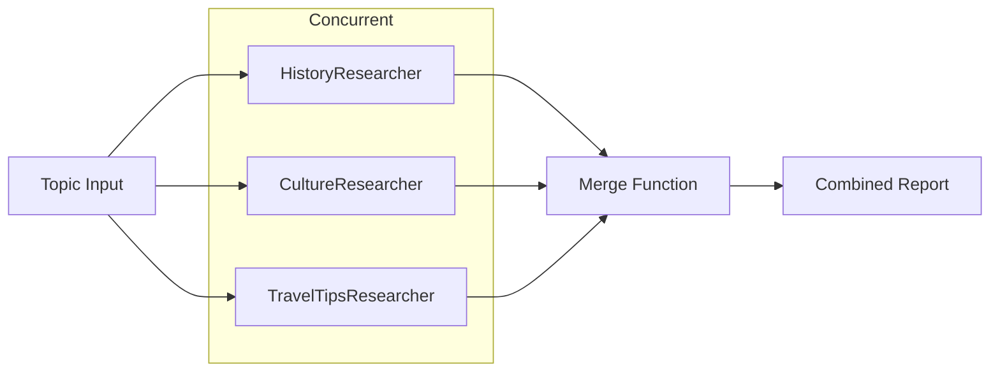

# Lab 20: Concurrent Workflows — Parallel Agent Execution

[📋 Back to Lab Guide](../../lab-guide.md)

**Duration:** 25 minutes
**Objective:** Build a workflow where multiple agents work **in parallel** using the concurrent pattern. A single input is distributed to multiple specialist agents simultaneously, and their results are combined by a merge function.

---

## What You'll Learn

- How to build concurrent workflows for parallel agent execution
- Defining a merge function to combine results from multiple agents
- How all agents receive the same input simultaneously
- Processing merged results from workflow output

## When to Use This Pattern

Use **concurrent workflows** when independent tasks can run in parallel for speed:

- **Multi-perspective analysis** — sentiment + keyword + summary of the same text, simultaneously
- **Fan-out / fan-in** — send the same input to N agents, merge results
- **Latency reduction** — 3 agents running in parallel take ~1x time, not ~3x

**When sequential is better:**

| Scenario | Use |
|----------|-----|
| Step B depends on Step A's output | **Sequential Workflows** (Lab 11/12) |
| Agents need to see each other's work | **Group Chat** (Lab 19) |
| Routing depends on content | **Handoff Workflows** (Lab 18) |

## Prerequisites

- Completed Lab 11 (Simple Workflows)
- Azure OpenAI endpoint configured

---

## Architecture

---

## Implementation

Choose your language:

- **[C# (.NET)](./csharp.md)**
- **[Python](./python.md)**

---

## Key Concepts

| Concept | Description |
|---------|-------------|
| **Concurrent Workflow** | Multiple agents process the same input simultaneously |
| **Merge Function** | Combines all agent outputs into a single result |
| **Parallel Execution** | All agents receive the same input and run concurrently |

## How It Works

1. **Input** arrives and is sent to all agents simultaneously
2. **Parallel Processing**: All researchers work concurrently
3. **Merge**: The merge function receives a list of results (one per agent)
4. **Combination**: The merge function assembles a combined report from all results
5. **Output**: The merged report is returned

## Performance Benefits

Concurrent execution significantly reduces total time. Instead of running three researchers sequentially (~9 seconds), they run in parallel (~3 seconds):

```mermaid
gantt
    title Execution Time Comparison
    dateFormat s
    axisFormat %S s

    section Sequential (~9s)
        History  :seq1, 0, 3s
        Culture  :seq2, after seq1, 3s
        Travel   :seq3, after seq2, 3s

    section Concurrent (~3s)
        History  :con1, 0, 3s
        Culture  :con2, 0, 3s
        Travel   :con3, 0, 3s
```

---

## 🏋️ Exercises

### Exercise A: Observe Parallel Execution

Run the workflow and note the total execution time. Compare it mentally to how long it would take to run each agent sequentially.

### Exercise B: Customize the Merge

Modify the merge function to format the output differently (e.g., as a numbered list, or with section headers).

---

## 🎯 Challenge

Add a fourth researcher (e.g., "BudgetExpert") and update the merge function to include its output. See how the concurrent pattern scales!

---

## ✅ Success Criteria

- [ ] Multiple agents run in parallel on the same input
- [ ] Results are merged into a combined report
- [ ] You understand the performance benefits of concurrent execution
- [ ] The merge function correctly combines all agent outputs

---

## What's Next?

In **Lab 21**, you'll combine everything — hosting multiple agents as a workflow, exposed via A2A protocol, creating a fully **hosted multi-agent system**.
